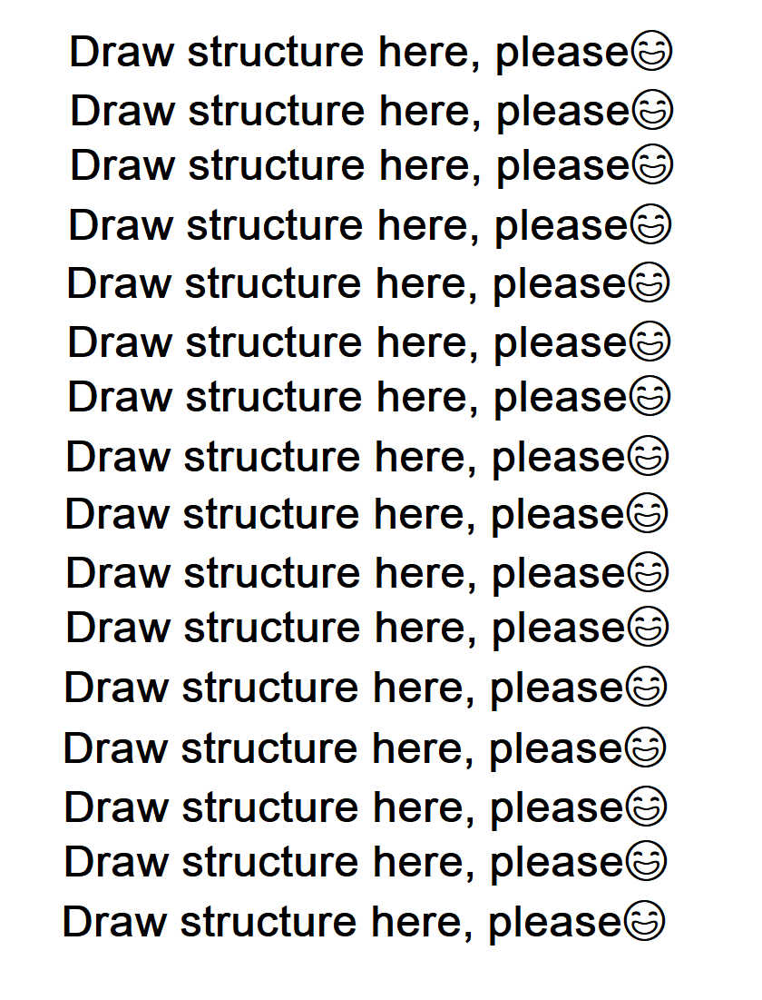

# Dangl.XRechnung.Examples

> An online version of the converter is freely accessible at [my blog](https://web-gaeb.de/)
> A more detailed feature description is available [on our website](https://www.dangl-it.com/products/xrechnung/).

> This project requires **Visual Studio 2017** or newer. Otherwise, the Dotnet CLI is also supported.

This is a _demonstration_ library intended to show the usage of the Dangl.XRechnung project.
To build this solution, you need to copy three packages into the `./packages` folder, relative to the root of this project:
* Dangl.XRechnung
* Dangl.AVA
* Dangl.AVA.IO

> If you are already a customer with support contract, please see any of the packages documentation on how to set up the official NuGet feed for **DanglIT** packages.

These packages are not included in this repository.
This project is intended to demonstrate the usage of the Dangl.XRechnung library.
[Please get in touch with us if you are interested in the libraries](https://www.dangl-it.com/contact/?message=I%27m+interested+in+Dangl.XRechnung.+Please+contact+me.).

## .NET support

All modules for XRechnung support both .NET Framework as well as modern .NET. This project produces .NET libraries by default. If you want to build for another .NET target, you have to update the framework in the project settings or simply change the `TargetFramework` entry in `Dangl.XRechnung.Examples.csproj`:

```xml
  <PropertyGroup>
    <OutputType>Exe</OutputType>
    <!-- This configures the project to build for .NET Framework 4.8.1 -->
    <TargetFramework>net481</TargetFramework>
    <!-- To build for .NET (8.0 in this case), simply use the value below -->
    <TargetFramework>net8.0</TargetFramework>
  </PropertyGroup>
```

## CLI Interface

The console application is launched via

    Dangl.XRechnung.Examples.exe -i <InputFile> -o <OutputFile>

| Parameter | Description |
|-----------|-------------|
| -i | Relative or absolute path to an input XRechnung file |
| -o | Path of the output file without extension. Will overwrite existing files |

## XRechnung Example Files

You can find examples of XRechnung files in the `XRechnungFiles` folder in the solution root directory.

## Library Key Features

* TODO: ADD A DETAILED LIST HERE

## Structure


